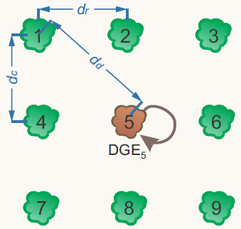
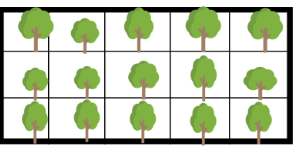



## Genetic competition on forest breeding

### Motivation  

{:width="50%" align="right"}

The performance of individual plants and the accuracy of genetic selection can be strongly influenced by genetic competition among neighboring genotypes. To better account for these interactions, models that partition observed genotypic variation into direct genotypic effects (DGEs) and competition effects—also known as indirect genotypic effects (IGEs)—were introduced by Muir (2005) and further developed by Cappa and Cantet (2008) using frequentist and Bayesian approaches, respectively. Our work explores the practical implications of IGEs in eucalypt breeding, particularly in contexts such as early selection and multi-age evaluations. We also propose selection strategies that leverage the depth and reliability of the information provided by these models for each individual. Furthermore, we use these models to predict high-performing combinations of clonal composites under intergenotypic competition, aiming to enhance genetic gain and stand productivity.

- **Main topics:**

   - **Genetic model's fitting**  
   - **Clonal composites prediction**  
   - **Competition classification**  
   - **Package development**

### Publications and packages

We published 2 papers and 1 R package about genetic competition models.
You can check the first paper [here](https://doi.org/10.1016/j.foreco.2023.121393). 
The second paper can be found [here](https://doi.org/10.1016/j.foreco.2024.121892).

As part of this topic, we created an R package for fitting genetic competion models.
*gencomp* can be downloaded from [here](https://github.com/Kaio-Olimpio/gencomp). 
Check out the [*gencomp* paper](https://doi.org/10.1038/s41437-024-00743-9)

A more didatic article about genetic competition can be found [here](https://vsni.co.uk/competitive-genetics-exploring-the-impact-of-direct-and-indirect-genetic-effects-in-tree-breeding/).

***

## Mixed models methodology

### Motivation
{:width="20%" align="right"}

Mixed models have become a fundamental tool in the statistical analysis of breeding program data, particularly due to their ability to handle unbalanced datasets and complex experimental designs. They allow the modeling of random effects and covariance structures, increasing the precision of genetic parameter estimates and the reliability of selection decisions. These capabilities make mixed models especially suited for modern plant breeding, including applications in genomic selection.

- **Mainly topics:**
  - **Variance components estimations**  
  - **Modelling**  
  - **Genomic selection**  
  - **Models with additive and non-additive effects**  

***

## Cloned Progeny Trials 

### Motivation  

{:width="50%" align="right"}

 By combining progeny and clonal trials in a single step, Cloned Progeny Trials (CPT) allows genotypes to be tested as clones from the start, improving the accuracy of genetic evaluation and saving valuable time in the breeding cycle. This is especially important for Eucalyptus species, which are highly productive and well-suited to clonal propagation. CPT improves the correlation between early and final performance, helps estimate genetic parameters more precisely, and supports faster decision-making. When integrated with genomic tools like SNP markers, CPT becomes even more powerful—making the breeding process more efficient and boosting genetic gains. For modern tree breeding, CPT is a key tool to deliver better clones, faster.

- **Objective**  
Improve the correlation between individual (seedling) performance in initial (progeny trials) and final (clonal trials) stages of the breeding program. 

***

## Partially inbred lines of eucalyptus

### Motivation  

Studying inbreeding-based strategies represents a significant advancement for the genetic improvement of forest species. While widely applied in annual crops, these approaches remain underexplored in perennial species such as Eucalyptus. Understanding the effects of self-pollination, the occurrence of inbreeding depression, and the contribution of non-additive genetic effects allows for the refinement of selection models and optimization of mating schemes. Moreover, the use of genomic tools enhances the ability to detect patterns of autozygosity and genetic variance, providing valuable support for more accurate and effective decision-making. By integrating this knowledge, it becomes possible to increase the efficiency of breeding programs, accelerate genetic gains, and ensure greater sustainability in forest production.

- **Objective**  
- Unravel the patterns of inbreeding depression in eucalyptus.

***

 

