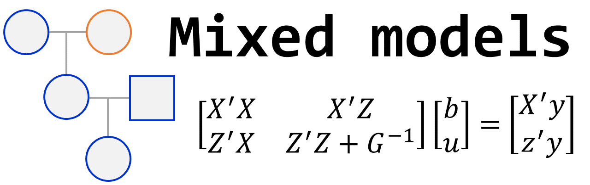
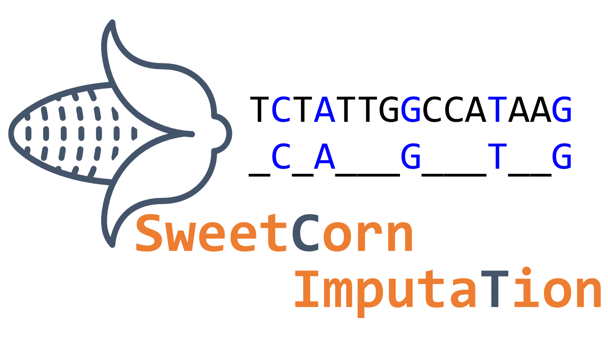



## Genetic competition on forest breeding

### Motivation  

{:width="20%" align="right"}

The performance of individual plants and the accuracy of genetic selection can be strongly influenced by genetic competition among neighboring genotypes. To better account for these interactions, models that partition observed genotypic variation into direct genotypic effects (DGEs) and competition effects—also known as indirect genotypic effects (IGEs)—were introduced by Muir (2005) and further developed by Cappa and Cantet (2008) using frequentist and Bayesian approaches, respectively. Our work explores the practical implications of IGEs in eucalypt breeding, particularly in contexts such as early selection and multi-age evaluations. We also propose selection strategies that leverage the depth and reliability of the information provided by these models for each individual. Furthermore, we use these models to predict high-performing combinations of clonal composites under intergenotypic competition, aiming to enhance genetic gain and stand productivity.

- **Main topics:**

   - **Genetic model's fitting**  
   - **Clonal composites prediction**  
   - **Competition classification**  
   - **Package development**

### Publications and packages

We published 2 papers and 1 R package about genetic competition models.
You can check the first paper [here](https://doi.org/10.1016/j.foreco.2023.121393). 
The second paper can be found [here](https://doi.org/10.1016/j.foreco.2024.121892).

As part of this topic, we created an R package for fitting genetic competion models.
*gencomp* can be downloaded from [here](https://github.com/Kaio-Olimpio/gencomp). 
Check out the [*gencomp* paper](https://doi.org/10.1038/s41437-024-00743-9)

A more didatic article about genetic competition can be found [here](https://vsni.co.uk/competitive-genetics-exploring-the-impact-of-direct-and-indirect-genetic-effects-in-tree-breeding/).

***

## Breeding programs simulations

### Motivation
{:width="30%" align="right"}

Breeding programs are intricate and multifaceted systems that demand careful consideration when implementing tools and refining resource allocation. Simulating breeding programs has emerged as a valuable approach for assessing and fine-tuning various aspects of these programs. This simulation method serves as an ideal platform for evaluating the overarching strategy and the intricate details of breeding programs. This includes aspects like selection methods, program sizes, the number of testers, the integration of genomic selection tools, and the optimal number of environments to be included.

- **Main topics:**
  - **Decision-based breeding**  
  - **Genomic selection implementation**
  - **Parental selection and allocation**  
 
***

## Mixed models methodology

### Motivation
{:width="30%" align="right"}

Mixed models methodology has become a standard tool for evaluating data in breeding programs, offering numerous advantages that motivate researchers to embrace them as a powerful tool in plant breeding. These models enhance genetic-statistical analyses, increase the accuracy of selection, provide a better understanding of trait architectures, and facilitate the implementation of genomic selection in breeding programs. These benefits serve as strong motivation for researchers to embrace mixed models and harness their power in breeding programs.

- **Mainly topics:**
  - **Variance components estimations**  
  - **Modelling**  
  - **Genomic selection**  
  - **Models with additive and non-additive effects**  
  - **BLUEs and BLUPs**  

***

## Markers panel imputation 

### Motivation  

{:width="30%" align="right"}

The implementation of Whole Genomic Selection has been proven as an important tool for increasing genetic gain in several breeding programs. However, the acquisition of such high-density covered markers represents a barrier to the implementation of WGS in breeding programs. One alternative is to input some markers rather than measure them directly, which could decrease the costs of WGS.

- **Objective**  
  - Evaluate the predictive ability of genomic values for some target traits in Sweet Corn when genotypes at some SNPs loci were imputed rather than measured directly.     

***

## Genotype-by-environment interaction in potato breeding program

### Motivation  

Large planted crops faces the

- **Objective**  
  - To recommend potato varietys for target population of environments.

***

 

