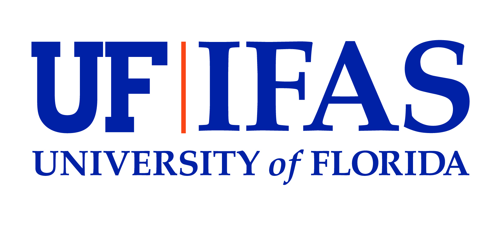

**Fall/2023**
{:width="20%" align="right"}  

***

# Breeding program simulations via AlphaSimR

Marco Antonio Peixoto  
Marcio Resende Jr.  
Camila Azevedo  
Luis Felipe Ferrao  

University of Florida  
13-15/Nov/23

**Schedule**  
Monday (11/13) - 10:00 am - 3:00 pm  
Tuesday (11/14) - 10:00 am - 3:00 pm   
Wednesday (11/15) - 9:00 - 11:00 am  
1:00 pm - 5:00 pm (if needed - this is blocked just as discussion time)  

***

# **Introduction**

{:width="45%" align="right"}  

Simulations have been demonstrated as a powerful tool to improve animal and plant breeding programs. In addition, those tools may offer an alternative to address theoretical concepts in quantitative genetics and breeding. Here, we are proposing to use AlphaSimR package (Gaynor et al. 2021) to guide a discussion about breeding program optimization. The package uses stochastic simulations for the design and optimization of breeding programs. It offers a fast, simple, and inexpensive way to test alternative breeding programs.

# **Recommended literature**

We recommend reading the following papers before the course, so should all be on the same page regarding simulations.

- Paper 1: Gaynor CR, Gorjanc G, and Hickey JM (2021). AlphaSimR: an R package for breeding program simulations. G3. https://doi.org/10.1093/g3journal/jkaa017
- Paper 2: Bančič, Jon, et al. (2021). Modeling illustrates that genomic selection provides new opportunities for intercrop breeding. Frontiers in Plant Science. https://doi.org/10.3389/fpls.2021.605172
- Paper 3: Werner, CR et al. (2023). Genomic selection strategies for clonally propagated crops. Theoretical and Applied Genetics. https://doi.org/10.1007/s00122-023-04300-6
- Vignette: https://cran.r-project.org/web/packages/AlphaSimR/vignettes/traits.pdf

# **Tentative program**

| Subject                                                  | Sections  | Time  |
|----------------------------------------------------------|-----------|-------|
|**Base population and Global parameters**                            |  Block 1  |  2 hr |
| -Genetic basis of base populations                       |                | 
| -Imputing real data into base population    |                 |
| -Trait characteristics                                   |                 |
| -QTL (and SNPs) for traits                                      |                |
| -Non-additive effects                                    |                 |
| -Population characteristics                              |                |
| **Functions in AlphaSimR**                                | Block 1   | 2 hr  |
| -Functions for modeling a breeding program               |           |       |
| **Breeding pipeline**                                     | Block 2   | 2 hr  |
| -From crosses to the release of varieties                     |           |       |
| -Recurrent Selection breeding program                     |           |       |
| -Reciprocal Recurrent Selection breeding program          |           |       |
| -Clonal breeding program                                  |           |       |
| **How to deploy Genomic selection in AlphaSimR**          | Block 2   | 2 hr  |
| -Models and predictions into AlphaSimR                |           |       |
| -RRBLUP, RRBLUP_D, RRBLUP_GCA, RRBLUP_SCA             |           |       |
| -Using external packages for predictions            |           |       |
| **Practical implementation GS**                          | Block 3   | 2 hr  |
| -Training populations                                 |           |       |
| -Comparison                                           |           |       |
| **Implementations/Discussion**                           | Block 4   | 4 hr  |

***

# Topics

## 1. Base population and Global parameters

- Content [[html]](https://htmlpreview.github.io/?https://github.com/marcopxt/marcopxt.github.io/blob/master/talks_teach/AlphasimR/1.BasePopTraits.html)
- Script [[rmd]](https://minhaskamal.github.io/DownGit/#/home?url=https://github.com/marcopxt/marcopxt.github.io/blob/master/talks_teach/AlphasimR/1.BasePopTraits.Rmd)
- Data [[externalData]](https://minhaskamal.github.io/DownGit/#/home?url=https://github.com/marcopxt/marcopxt.github.io/blob/master/talks_teach/AlphasimR/External_Data.RData)

## 2. Functions in AlphaSimR 

- Content [[html]](https://htmlpreview.github.io/?https://github.com/marcopxt/marcopxt.github.io/blob/master/talks_teach/AlphasimR/2.AlphaSimR_Functions.html)
- Script [[rmd]](https://minhaskamal.github.io/DownGit/#/home?url=https://github.com/marcopxt/marcopxt.github.io/blob/master/talks_teach/AlphasimR/2.AlphaSimR_Functions(RMD).Rmd)

## 3. Breeding Pipeline

- Content - Recurrent selection program [[html]](https://htmlpreview.github.io/?https://github.com/marcopxt/marcopxt.github.io/blob/master/talks_teach/AlphasimR/3.WheatBreeding.html)
- Script [[rmd]](https://minhaskamal.github.io/DownGit/#/home?url=https://github.com/marcopxt/marcopxt.github.io/tree/master/talks_teach/AlphasimR/3.Wheat)

- Content - Reciprocal recurrent selection program [[html]](https://htmlpreview.github.io/?https://github.com/marcopxt/marcopxt.github.io/blob/master/talks_teach/AlphasimR/3.MaizeBreeding.html)
- Script [[rmd]](https://minhaskamal.github.io/DownGit/#/home?url=https://github.com/marcopxt/marcopxt.github.io/blob/master/talks_teach/AlphasimR/3.MaizeBreeding(RMD).Rmd)

## 4. How to deploy Genomic selection in AlphaSimR

- Content [[HTML]]
- Script [[rmd]]
  
## 5. Practical implementation GS

- Link 
